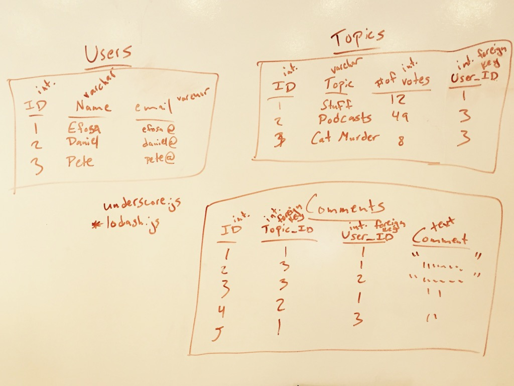

##Podcast Hunt
*Podcast Hunt is a discussion forum for podcasts. Users can post topics or comment on other topics.*

[Link to Deployed Version of Podcast Hunt](http://45.55.169.72)

[Link to Trello board](https://trello.com/b/EiOsxalM/wdi-project-one)

##Features

**1. A user can view all of the topics that have been posted, see how the number of comments, and upvote individual posts. Topics can be sorted.**


**2. A user can create a new topic by clicking on Post Topic. On topics and comments, the users location will be logged automatically when posting. It can be updated later on the edit pages.**


**3. A user can create a new account on the Create Account Page.**


**4. A user can view individual topic pages and comment on an existing topic.**


**5. The users page shows a list of all of the current users. When a user clicks on a user's name, they can view all posts associated with that user. A user's information can be edited by clicking edit.**


**6. Topics can be edited by clicking on the "Edit this topic" link at the bottom of a topic page. Deleting a topic will delete all associated comments. Comments can edited/deleted individually.**


**ERD**



**APIs and Modules Used**
- express - used to build server
- sqlite3 - used for database
- mustache - used to render html
- body-parser and method-override - used to deal with forms on html templates.
- marked - used to convert posts from markdown to html.
- request - for http requests.
- morgan - server logging.
- bootstrap - CSS templates.
- IPInfo - to display location when posts are made.

**Instructions for Running on Localhost**
- download / clone repo
- in Forum folder, run "npm install" in command line
- create config.js file with the following code (switch 3000 to choose a different port)

```
var information = {};
module.exports = information;
information.port = 3000;
```
